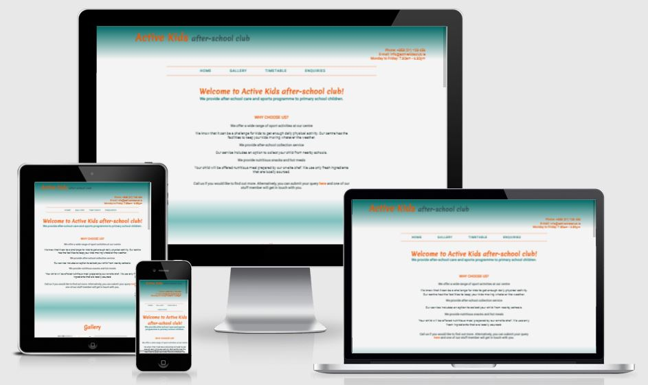

[Link to the live project](https://ip69719.github.io/MS-Project-1-v-3/)

# Welcome to my first website!

This project was created for an imaginary after-school childcare service.

## User Experience (UX)

### Project Goals

The primary Project Goal is to create a marketing website for 'ActiveKids After-school club'.

The target audience are working parents who are looking for flexible after-school childcare arrangements that support parents' busy lifestyle and provide excellent after school care for primary school children offering a wide range of sport activities.

### User Stories

*   User stories
    * First Time Visitor Goals
        * As a First Time Visitor, I want to understand the main purpose of the site and learn more about the organisation.
        * As a First Time Visitor, I want to be able to easily navigate throughout the site to find content.
        * As a First Time Visitor, I want to easily locate their contact information.

    * Returning Visitor Goals
        * As a Returning Visitor, I want to find the best way to get in contact with the organisation with any questions I may have during and outside normal working hours.

    * Frequent User Goals
        * As a Frequent User, I want to check to see if there are any new services or activities offered.

### Design choices

* Colour Scheme
    * I decided to use shades of orange, blue-green and gray colours for my website because I find that these colours complement each other and are pleasing to the eye.

* Typography
    * The Roboto font is the main font used throughout the whole website. Roboto was chosen for its friendly features.
Merienda font is ideal for headlines.

* Imagery
    * Images were selected to support the project goal. The aim is to show children having fun and enjoying various activities (I feel that the home page is lacking an image. The website would have made stronger impact if Users were presented with an image supporting the project idea.

### Wireframes

* [Home Page Wireframe ](https://github.com/ip69719/MS-Project-1-v-3/blob/main/assets/docs/wireframes/ms1_wireframe_desktop.pdf)
* [Mobile Wireframe ](https://github.com/ip69719/MS-Project-1-v-3/blob/main/assets/docs/wireframes/ms1_wireframe_phone.pdf)
* [Tablet Wireframe ](https://github.com/ip69719/MS-Project-1-v-3/blob/main/assets/docs/wireframes/ms1_wireframe_tablet.pdf)

## Features

* Responsive design on most device sizes

## Technologies used

### Languages used

* [HTML5](https://en.wikipedia.org/wiki/HTML5)
* [CSS3](https://en.wikipedia.org/wiki/CSS)

### Frameworks, Libraries & Programs Used

* [Google fonts](https://fonts.google.com/) were used to import the 'Merienda' and 'Roboto' fonts into the style.css file which is used on all pages throughout the project.

* [Font Awesome](https://fontawesome.com/) was used to obtain the social media icons used in the footer.

* [Fancybox](https://fancyapps.com/docs/ui/fancybox/) was used to format the photo gallery.

* [Google Developer Tools](https://developer.chrome.com/docs/devtools/) was used for testing responsiveness of the website.

* [Balsamiq Wireframes](https://balsamiq.com/) was used to create wireframes for the project.

* [Git](https://git-scm.com/) was used for version control by utilizing the Gitpod terminal to commit to Git and Push to GitHub.

* [GitHub](https://github.com/) is used to store the projects code after being pushed from Git.

## Testing

* The W3C Markup Validator and W3C CSS Validator Services were used to validate the project to ensure there were no syntax errors.

    * W3C Markup Validator - [Results](https://github.com/ip69719/MS-Project-1-v-3/blob/main/assets/docs/testing/w3c_markup_validation_results.pdf)

    * W3C CSS Validator - [Results](https://github.com/ip69719/MS-Project-1-v-3/blob/main/assets/docs/testing/w3c_css_validation_results.pdf)

    * Navigation and other internal links were tested to confirm that User is brought to the relevent section of the webpage when any of the links is clicked.

    * Testing was carried out to confirm that when User clicks on the social media icons in the footer the link to social media account opens in a new tab.

    * Testing was performed on contact form to ensure that User input is validated before the form can be submitted: required fields cannot be empty, email address is in the expected format.
    

    *   User stories
        * **As a First Time Visitor, I want to understand the main purpose of the site and learn more about the organisation.**
        As soon as the page is opened User is presented with a welcome message that states the purpose of the organisation and describes main services.
        
        *  **As a First Time Visitor, I want to be able to easily navigate throughout the site to find content.**
        The website has a navbar that is centered just under the header. When any of the nav links is clicked the User can easily get access to relevant section of the page.
        
        * **As a First Time Visitor, I want to easily locate their contact information.**
        The heading of the website contains the phone and e-mail contact. There is Enquiries nav link on the top of the page that brings the User to the contacts section. Here the User can view the full contact details and can submit a query to the organisation by filling out the form.
        
        
        
    * Known Bugs

        * The site is not fully responsive for smaller phone screens.
        * Dummy URL used for action attribute to send the form-data when a form is submitted. 

## Deployment

### GitHub Pages

The project was deployed to GitHub Pages using the following steps:

1. Log in to GitHub and locate the [GitHub Repository](https://github.com/ip69719/MS-Project-1-v-3)
1. In the menu located at the top of this section, click 'Settings'.
1. Scroll down the Settings page until you locate the "GitHub Pages" Section and click on the link provided.
1. Under "Source", click the dropdown and select "main" Branch and "/root" folder and then save.
1. The page is then given a site URL which you will see above the source section.

### Forking the GitHub Repository

By forking the GitHub Repository we make a copy of the original repository on our GitHub account to view and/or make changes without affecting the original repository by using the following steps:

1. Log in to GitHub and locate the [GitHub Repository](https://github.com/ip69719/MS-Project-1-v-3)
1. In the top right corner of the page, click the Fork button 
1. You should now have a copy of the original repository in your GitHub account.

### Making a Local Clone

1. Log in to GitHub and locate the [GitHub Repository](https://github.com/ip69719/MS-Project-1-v-3)
1. Click "Code" botton (beside the green Gitpod botton).
1. To clone the repository using HTTPS, under "Clone with HTTPS", copy the link that is shown in the drop-down.
1. Open Git Bash
1. Change the current working directory to the location where you want the cloned directory to be made.
1. Type git clone, and then paste the URL you copied in Step 3.
$ git clone https://github.com/ip69719/MS-Project-1-v-3.git
1. Press Enter. Your local clone will be created.

## Credits

### Content

* Content of READ.md was written with reference to [Example README.md template](https://github.com/Code-Institute-Solutions/SampleREADME).

### Media

* Free image was sourced from [Shutterstock](https://www.shutterstock.com/home)

### Code

* Adopted the code for creating image gallery from [Fancybox](https://fancyapps.com/docs/ui/quick-start) and this [freeCodeCamp tutorial](https://www.freecodecamp.org/news/how-to-create-an-image-gallery-with-css-grid-e0f0fd666a5c/).

* learned about CSS Gradients from this [W3 schools](https://www.w3schools.com/css/css3_gradients.asp) tutorial.

* learned how disable the resizable property of a textarea from this [stackoverflow](https://stackoverflow.com/questions/5235142/how-do-i-disable-the-resizable-property-of-a-textarea/) post.

* Learned and adopted code for border-collapse property from [DEV](https://dev.to/dcodeyt/creating-beautiful-html-tables-with-css-428l).

* Learned and adopted code for table-layoutcss property from  [MDN Web Docs](https://developer.mozilla.org/en-US/docs/Web/CSS/table-layout)

* Learned and adopted code for for :placeholder property to change the color of the placeholder text from [W3 schools](https://www.w3schools.com/howto/howto_css_placeholder.asp)

### Acknowledgements

* Special thanks to my Mentor for support and guidance and to Code Institute for exellent leaning materials.